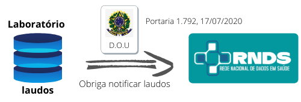

## Guia do Desenvolvedor RNDS

Objetivo:

> Detalhar os passos necessários e orientações, inclusive técnicas, para integração com a RNDS.

Avisos:

- Este **NÃO** é um portal do DATASUS/MS.
- Este **NÃO** é o portal da RNDS/DATASUS. O portal da RNDS é http://rnds.saude.gov.br.
- Este portal **NÃO** está associado, não é mantido, não é vistoriado, não é acompanhado nem auditado pelo DATASUS ou pelo Ministério da Saúde.
- Este portal **NÃO** contém nenhuma informação privilegiada ou algo similar, ao contrário, tudo o que aqui está registrado pode ser encontrado na internet, sem restrição de acesso.

Se você é desenvolvedor e, por algum motivo, precisa escrever código para enviar
dados ou consultar informações fornecidas pela RNDS, então este portal é para você!

## Mapa de orientação

Em um cenário convencional, sem a introdução da RNDS, laudos produzidos permaneceriam restritos ao sistema de software do laboratório em questão.
Conforme ilustrado abaixo, em algum momento seriam enviados para uma base de dados, ou ilha
privada, segura, inacessível até aos pacientes.

A saúde, contudo, demanda mudança. O processo anterior, figura acima, deve ser estendido para que laudos cruzem as fronteiras
dos laboratórios em que foram produzidos. A intenção é "fazer a informação
em saúde chegar onde ela é necessária". A RNDS é o meio adotado pelo Brasil, conforme a Portaria 1.792, de 17 de julho de 2020, do Ministério da Saúde,
que estabelece a obrigatoriedade de notificação de resultados de testes de SARS-CoV-2. Na prática, isso significa que laboratórios terão que produzir _software_ para integração com a RNDS, conforme ilustrado abaixo.

O presente documento tem como compromisso identificar todos
os passos necessários, desde administrativos até técnicos (produção de _software_), para realizar tal notificação. Dito de outra forma, para realizar a _integração com a RNDS_.

## Integração com a RNDS

A integração com a RNDS exige ações realizadas por dois atores: (a) o responsável pelo laboratório e (b) o responsável pela TI (Tecnologia
da Informação) do laboratório.

### Atribuições do responsável pelo laboratório

1. Adquirir o certificado digital a ser utilizado para identificar o laboratório junto à RNDS. Este certificado é empregado no item seguinte (_solicitar acesso_) e também pelo _software_ de integração com a RNDS. O _software_ de integração é atribuição do responsável pela TI do laboratório (seção seguinte).
1. Solicitar acesso junto à RNDS. Esta solicitação é necessária para credenciamento do laboratório junto à RNDS. Este credenciamento dá origem
   ao **identificador do solicitante**, que será empregado pelo _software_ de integração. Esta solicitação é realizada com o apoio do responsável pela TI do laboratório, dado que depende de informações como faixa de IPs dos
   servidores empregados pelo laboratório e serviços a serem requisitados, dentre outros.
1. Esclarecer mapeamentos eventualmente necessários entre os dados produzidos por um laudo e aqueles esperados pela RNDS. O laboratório pode empregar uma terminologia ou códigos próprios para identificar os exames que realiza, enquanto a RNDS espera um código baseado no LOINC, por exemplo. Neste caso, cabe ao responsável pelo laboratório realizar o mapeamento entre os códigos que o laboratório faz uso e aqueles esperados pela RNDS.

### Atribuições do responsável pela TI do laboratório

1. Propor e desenvolver _software_ de integração. A proposta depende do contexto em questão, contudo, invariavelmente, terá que realizar funções bem-definidas.
1. Homologar. O _software_ deverá ser experimentado no ambiente de homologação. Esta experimentação deverá gerar evidências de que se integra satisfatoriamente à RNDS.
1. Colocar em produção. Algumas configurações são alteradas, como os
   endereços dos serviços do ambiente de produção.

- extrair dados do sistema de software empregado pelo laboratório;
- mapear código empregados pelo laboratório e/ou transformações de dados necessários para se adequar às exigências da RNDS;
- empacotar os dados na representação a ser utilizada para envio (JSON) e
- enviar os dados para a RNDS.

A figura ilustra as atribuições destes dois atores.

## Outros

- [Tecnologias](documentos/tecnologias.md)
- Fluxo:
  - Administrador
    - Certificado
    - Cadastro no Portal de Serviços
  - Ambiente de desenvolvimento
    - Postman
    - Java
  - Aplicações
    - Obter token
    - Consultar ...
