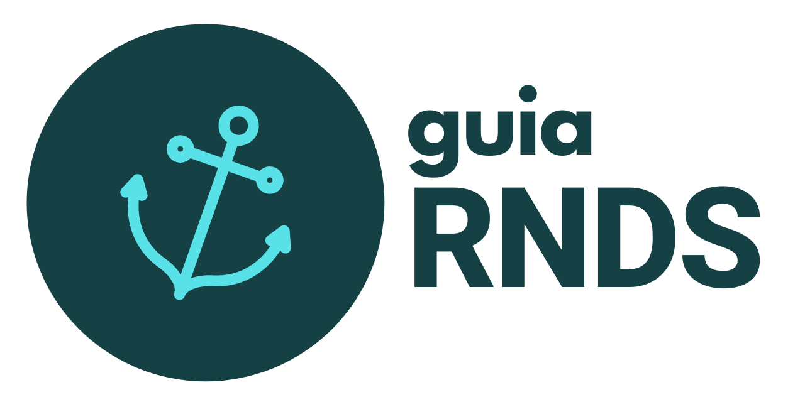
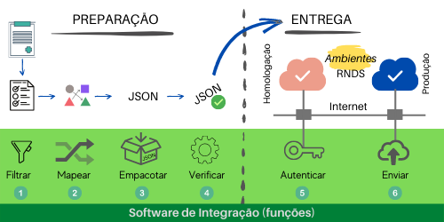

## Guia do Desenvolvedor RNDS

Objetivo:

> Usufruir dos serviços da RNDS.

Avisos:

- Este **NÃO** é um portal do DATASUS/MS.
- Este **NÃO** é o portal da RNDS/DATASUS. O portal da RNDS é http://rnds.saude.gov.br.
- Este portal **NÃO** está associado, não é mantido, não é vistoriado, não é acompanhado nem auditado pelo DATASUS ou pelo Ministério da Saúde.
- Este portal **NÃO** contém nenhuma informação privilegiada ou algo similar, ao contrário, tudo o que aqui está registrado pode ser encontrado na internet, sem restrição de acesso.

Se você é desenvolvedor e, por algum motivo, precisa escrever código para enviar
dados ou consultar informações fornecidas pela RNDS, então este portal é para você!

## Mapa de orientação

Em um cenário convencional, sem a introdução da RNDS, laudos produzidos permaneceriam restritos ao sistema de software do laboratório em questão.
Conforme ilustrado abaixo, em algum momento seriam enviados para uma ilha
privada, segura, inacessível até aos pacientes.

A saúde, contudo, demanda mudança. O processo anterior, figura acima, deve ser ajustado para que laudos cruzem as fronteiras
dos laboratórios em que foram produzidos. A intenção é "fazer a informação
em saúde chegar onde ela é necessária". A RNDS é o meio adotado pelo Brasil.

Os laboratórios continuam realizando suas atividades fins, como antes.
Neste momento, contudo, é preciso que o responsável pelo laboratório
realize um Projeto de Integração com a RNDS. Este projeto demanda
a produção de código (_software_) que possui quatro características
principais, conforme ilustrado na figura abaixo.

- [Tecnologias](documentos/tecnologias.md)

- Fluxo:
  - Administrador
    - Certificado
    - Cadastro no Portal de Serviços
  - Ambiente de desenvolvimento
    - Postman
    - Java
  - Aplicações
    - Obter token
    - Consultar ...
