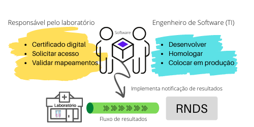

A integração com a RNDS exige ações realizadas por dois atores: (a) o responsável pelo laboratório e (b) o responsável pela TI (Tecnologia
da Informação) do laboratório. O responsável pela TI pode ser um colaborador
do próprio laboratório ou serviço oferecido por empresa especializada,
dentre outros cenários. A figura abaixo compila as atribuições de ambos.

## Responsável pelo laboratório

São atribuições possivelmente realizadas pelo responsável pelo laboratório:
(a) Adquirir certificado digital; (b) Solicitar acesso e (c) Validar mapeamento.

### Adquirir certificado digital

Adquirir o certificado digital a ser utilizado para identificar o laboratório junto à RNDS. Este certificado é empregado no item seguinte (_solicitar acesso_) e também pelo _software_ de integração com a RNDS. O _software_ de integração é atribuição do responsável pela TI do laboratório (seção seguinte).

A execução satisfatória desta atribuição resulta em:

- Certificado digital, arquivo **.pfx**, disponibilizado.
- Senha secreta de acesso ao certificado disponibilizada para uso pelo profissional de TI do laboratório.

### Solicitar acesso

Credenciamento junto à RNDS. Esta solicitação é necessária para credenciamento do laboratório junto à RNDS. Este credenciamento dá origem
ao **identificador do solicitante**, que será empregado pelo _software_ de integração. Esta solicitação é realizada com o apoio do responsável pela TI do laboratório, dado que depende de informações como faixa de IPs dos
servidores empregados pelo laboratório e identificação dos serviços a serem requisitados, dentre outros.

A execução satisfatória desta atribuição resulta em:

- Credenciamento concluído e submetido.
- Acesso ao ambiente de homologação concedido.
- Identificador do solicitante disponibilizada para uso pelo profissional de TI do laboratório. Este identificador é fornecido pela RNDS quando o acesso ao ambiente de homologação é concedido.

### Validar mapeamentos

Dados produzidos por um laudo devem ser mapeados para aqueles esperados pela RNDS, e o responsável pelo laboratório também é responsável pelo mapeamento correto.

O laboratório pode empregar uma terminologia ou códigos próprios para identificar os exames que realiza, enquanto a RNDS espera um código baseado no LOINC, por exemplo. Neste caso, cabe ao responsável pelo laboratório realizar o mapeamento entre os códigos que o laboratório faz uso e aqueles esperados pela RNDS.

A execução satisfatória desta atribuição resulta em:

- Revisão de todos os itens de dados exigidos pela RNDS para um resulta do exame de COVID.
- Identificação dos itens de dados dos quais aqueles exigidos pela RNDS serão obtidos.
- Identificação do mapeamento, se for o caso, entre o item de dado de origem do laboratório e o item de dado exigido pela RNDS.

## Responsável pela TI do laboratório

### Desenvolver

A proposta e desenvolvimento do _software_ de integração para um dado laboratório depende do contexto em questão, contudo, invariavelmente, o _software_ a ser produzido terá que realizar funções bem-definidas. Veja aqui tais [funções](./si).

### Homologar

O _software_ deverá ser experimentado no ambiente de homologação. Esta experimentação deverá gerar evidências de que se integra satisfatoriamente à RNDS.

### Colocar em produção

Algumas configurações são alteradas, como os
endereços dos serviços do ambiente de produção.
