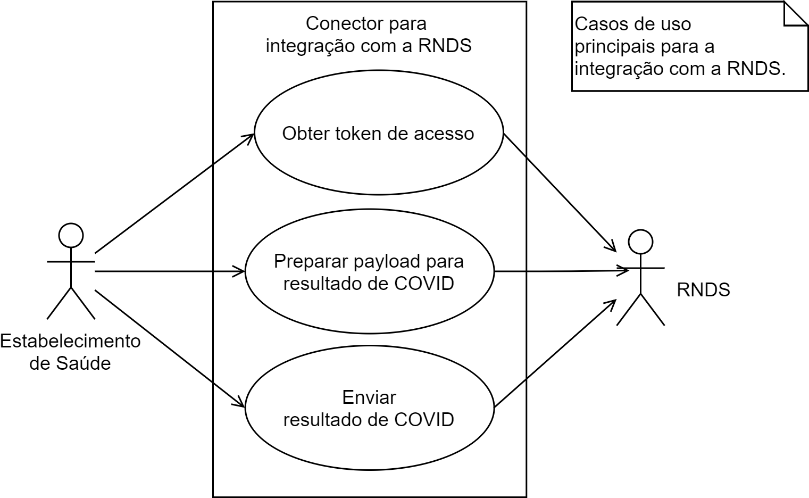
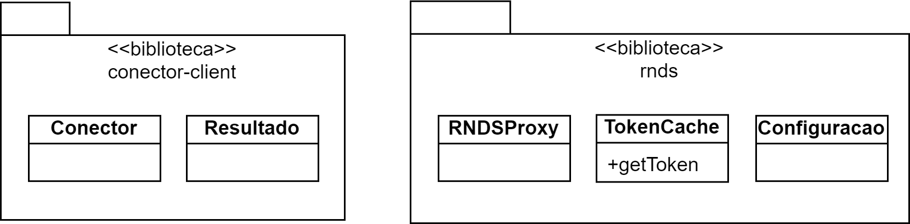

Conector é o nome dado à solução tecnológica que acessa a RNDS. É este software que precisa ser desenvolvido pelo integrador e, de fato, o que implementa a troca de informação em saúde com a RNDS. Por exemplo, no contexto de um laboratorio, faz parte das funções do Conector enviar o resultado de um exame laboratorial para a RNDS.

As seções seguintes apresentam questões típicas da integração com a RNDS por meio de um Conector de referência, abstrato o suficiente para que possa servir de orientação para vários estabelecimentos de saúde interessados em detalhes técnicos da integração com a RNDS.

## Sistema de Informação em Saúde (SIS)

Um estabelecimento de saúde usa, em geral, um Sistema de Informação em Saúde (SIS) para auxiliar na gestão das suas demandas, usuários, profissionais de saúde, procedimentos e outros. Tal sistema está ou não integrado à RNDS, o que é ilustrado pelos
cenários abaixo.


Adicionalmente, pode-se representar abstratamente qualquer SIS como a união de dois componentes: (a) um Banco de Dados, no qual informações administrativas e outras de saúde são armazenadas; e (b) o software propriamente dito do SIS.

Esta organização abstrada de um SIS em apenas dois componetes é útil para identificar o que é denominado de Conector, o que é feito abaixo por meio dos dois cenários ilustrados acima.

### Sem integração

Usando esta abstração, quando não há interoperabilidade do SIS com outro sistema, não há software de integração, não há Conector e, consequentemente, não há integração com a RNDS, conforme ilustrado abaixo.


### Com integração

A integração exige a existência do Conector.
A implementação das funções deste software pode assumir várias formas. Duas delas são apresentadas abaixo.

Na primeira, o SIS empregado pelo estabelecimento de saúde passa por uma manutenção na qual as funções do Conector são fundidas ao SIS existente. O SIS, agora modificado, torna-se um SIS que interage com a RNDS, um SIS integrado à RNDS.


Na segunda, um componente específico reúne e isola as funções necessárias para a integração com a RNDS, diferente do cenário anterior. Neste caso, é possível que o Conector seja encarregado de obter as informações em saúde a serem transferidas, possivelmente acessando diretamente o Banco de Dados do estabelecimento de saúde.


### _Design_ do Conector (sem restrições?)

Convém esclarecer que estas duas formas de integração não são as únicas, e que a RNDS não impõe exigências na organização do SIS em questão. De fato, nem sequer há uma sugestão de _design_ para o Conector, pois isto depende de inúmeras variáveis específicas de cada estabelecimento de saúde e, consequentemente, é assunto interno de cada estabelecimento.

## Conector de referência

Tendo em vista as especificidades de cada integração, única por estabelecimento de saúde, não é factível definir uma análise e um _design_ adequados para todos eles. O que segue, portanto, é uma investigação preliminar com o objetivo de oferecer uma orientação para integradores. A estratégia é familiarizar o integrador com questões naturais da integração com a RNDS.

### Escopo

O Conector, como qualquer outro software, visa atender alguma demanda. Para o Conector de referência a demanda (escopo) é a Portaria 1.792, que determina a obrigatoriedade de notificação de resultados de exame da COVID-19. Convém observar que a notificação de laudo de COVID-19 é a primeira necessidade de troca de informação contemplada pela RNDS.

Ao longo do tempo, outras necessidades serão incluídas, como a notificação do Sumário de Alta (SA) e do Registro de Atendimento Clínico (RAC), por exemplo. Cada necessidade é detalhada tanto pelo modelo de informação quanto pelo modelo computacional, o que viabiliza a integração com a RNDS para a necessidade em questão.

Naturalmente, à medida que novas necessidades de integração forem implementadas pela RNDS, mais informações em saúde e outros tipos de estabelecimentos de saúde estarão envolvidos.


Apesar do Conector de referência atender uma necessidade específica (notificar laudos de COVID-19), a discussão do mesmo permanece relevante para outras demandas.

## Requisitos

A integração, no escopo identificado acima, possui dois casos de uso principais: _Obter token de acesso_ e _Enviar resultado de exame_.



Um Conector pode envolver outras funções. Por exemplo, responder se um determinado resultado foi submetido satisfatoriamente ou não e recuperar a resposta da RNDS para uma dada notificação entregue são algumas das possibilidades. Estas funções são possivelmente necessárias, mas ao mesmo tempo "genéricas", não são específicas da integração com a RNDS. Em consequência, apenas os casos de uso citados acima são considerados.

:::tip Nota
Compreender os casos de uso _Obter token de acesso_ e _Enviar resultado de exame_ significa compreender o que é relevante para qualquer integração com a RNDS, e não apenas para a notificação de resultado do COVID-19. Eles representam a segurança e uma necessidade de interoperabilidade em saúde, respectivamente.
:::

### Obter token de acesso

A obtenção de um _token_ de acesso é necessária para identificar o estabelecimento de saúde e verificar se o mesmo possui acesso aos serviços que irá requisitar à RNDS. Esta função, portanto, é exclusivamente para segurança.

Será necessário o certificado digital (e-CPF ou e-CNPJ) associado ao estabelecimento de saúde e a senha de acesso ao certificado. Estas duas informações serão empregadas para
efetuar uma requisição _https_ que, se executada satisfatoriamente, deverá retornar um objeto JSON como aquele abaixo.

```json
{
  "access_token": "longa sequência de caracteres",
  "scope": "read write",
  "token_type": "jwt",
  "expires_in": 1800000
}
```

O que interessa é o valor para `access_token`, uma sequência
de mais de 2K caracteres. Outro valor retornado é o tempo
de validade deste _token_, neste caso, 30min, ou 1.800.000ms. A expectativa é de que o Conector só realize uma requisição para obter _token_ de acesso cerca de 30 minutos após a última requisição. Neste intervalo, o Conector deve guardar o valor do _token_ a ser reutilizado, até que seja substituído por uma nova requisição, cerca de 30 minutos depois.

:::info IMPORTANTE
O Conector deve reutilizar o valor obtido para `access_token`
durante o período em que ele é válido. Isto significa que
muitas requisições aos _web services_ de saúde possivelmente serão feitas usando um mesmo valor de _token_, obtido de uma
única requisição para um _web service_ de segurança.
:::

A obtenção do _token_ de acesso é uma forma de autenticação
do Conector, ou melhor, do estabelecimento de saúde, usando
um certificado digital, uma estratégia mais segura que a autenticação comum usando o par usuário/senha.

:::info Java e JavaScript
Em https://github.com/kyriosdata/rnds encontram-se os
projetos `rnds-java` e `rnds-js`, ambos ilustram como obter
o _token_ de acesso, respectivamente nas linguagens Java e JavaScript.
:::

Aos interessados, muita informação pode ser encontrada
na internet para o assunto "ssl client authentication".

### Enviar resultado de exame

Na perspectiva de processos (funções) e do fluxo de informações entre eles, o envio de resultado de exame é ilustrado abaixo. Aqueles processos coloridos são genéricos no sentido em que não dependem do SIS em questão. Os demais dependem diretamente do SIS para o qual o Conector é criado.


As funções são comentadas abaixo após ressaltar que, dependendo do SIS em questão, algumas delas podem não ser
necessárias. Por exemplo, se um dado SIS já guarda informações sobre cada resultado de exame em documento XML próprio, então não será necessário coletar informações dispersas, filtrar e talvez nem tampouco efetuar algum mapeamento. Ou, se preferir,
estas funções foram realizadas, mas em momento distinto do
envio propriamente dito.

- **Filtrar dados**. Seleciona os dados de um resultado de exame contendo o que é necessário para o envio.

- **Mapear dados**. Realiza a conversão e/ou mapeamento, se for o caso, entre o que é recuperado (função acima) e o formato exigido pela RNDS. Por exemplo, a data "01/01/21" é
  mapeada para "01/01/2021".

- **Criar instância de recurso**. Os dados já filtrados e mapeados empregam uma estrutura de dados que precisa ser representada em JSON, em conformidade com o recurso FHIR (_resource_) pertinente.

- **Montar bundle**. Empacota os recursos pertinentes na representação JSON de um _Bundle_ (um dos recursos FHIR).
  Quando executada, esta função também pode realizar a
  verificação da representação resultante. Ou seja, assegurar
  que foi criada conforme esperado pela RNDS.

- **Obter token**. Obtém _token_ do _web service_ de segurança da RNDS para acesso aos demais serviços.

- **Submeter requisição**. Notifica o resultado de um exame à RNDS. Esta é a função que, de fato, realiza o envio desejado, faz uso de um _web service_ com foco na saúde. Observe que este envio depende do _token_ obtido pela função acima.

A figura abaixo ilustra os processos executados em uma sequência típica, além do _web service_ de segurança e daqueles de saúde oferecidos pela RNDS, identificados respectivamente por _Auth_ e _EHR_. Em tempo, tais serviços são oferecidos pelos [ambientes](rnds/ambientes) da RNDS.


Convém esclarecer que a especificação de requisitos de software está além do alcance deste documento, dado que só poderia ser produzida para uma situação específica de integração. A boa notícia é que estaria além do necessário
para a formação do integrador.

## Design

Os cass de uso podem ser realizadas de várias maneiras. Abaixo segue apenas um possível _design_, dado que não são fornecidos detalhes de uma integração específica. Nesta possível solução, o Conector é implementado por um
microsserviço acionado por evento.

> IMPORTANTE: o emprego de um
> microsserviço visa ilustrar como o Conector pode ser
> implementado, em algum possível cenário, e não se confunde com uma recomendação.

O evento sinaliza a geração de um laudo de exame, conforme ilustrado abaixo. Dessa forma, o
SIS é modificado para gerar um evento, e o microsserviço (Conector)
notifica o Ministério da Saúde por meio da RNDS.


O Conector está isolado do restante do SIS, é um microsserviço. O _design_ do
código deste microsserviço pode ser influenciado por vários fatores, questão já levantada anteriormente, até mesmo a formação do integrador e a expectativa de qualidade para o Conector, por exemplo, dentre muitos outros. Ou seja, é natural existirem alternativas para o que segue, inclusive "melhores" (sugestões são bem-vindas).

Considerações feitas, a orientação é um _design_ que privilegie a legibilidade e
a manutenibilidade. Qualquer outra questão será secundária a estas.

A visão funcional do caso de uso _Enviar resultado de exame_ inspira o _design_.

### Esboço inicial

Em um primeiro esforço foram identificadas as classes abaixo. Aquelas não coloridas realizam as funções do negócio (caso de uso _Enviar resultado de exame_). As demais
oferecem o suporte necessário.


A classe `Conector` encapsula a conexão do SIS com o microsserviço. Desta forma,
a implementação correspondente, por exemplo, se uma requisição _https_ ou o envio
de uma mensagem por meio de [ActiveMQ](https://activemq.apache.org/) (_message broker_) ou [SNS](https://aws.amazon.com/sns/), fica encapsulada nesta classe.
Em consequência, o código que faz uso desta classe executa uma simples mensagem como
`Conector.notifique(resultado)`, por exemplo.

Este microsserviço deve possuir o seu próprio repositório onde são registradas as
requisições recebidas e os resultados obtidos das submissões. Cada submissão reúne o que é submetido, o `Resultado` de um exame e a resposta apresentada pela RNDS (para eventual consulta posterior). Talvez um nome melhor
para o repositório seja `ConectorRepositry`, em vez de `ResultadoRepository`.

O envio propriamente dito de informação para a RNDS está encapsulada na classe `RNDSProxy`. Este envio depende do _token_ de acesso cuja gestão pode estar encapsulada
na classe `TokenCache`. Naturalmente, estas funções dependem de valores que variam ao
longo do tempo e são obtidos, nesta proposta, pela classe `Configuracao`. Por exemplo, o certificado digital e a senha correspondente são algumas das informações obtidas por meio desta classe.

As três classes comentadas no parágrafo anterior implementam funções de acesso à RNDS e, naturalmente, devem ser reutilizadas, o que as tornam candidatas a serem transferidas para uma biblioteca. A biblioteca [rnds](https://www.npmjs.com/package/rnds) é um exemplo deste _design_.

Em consequência, podemos definir duas bibliotecas e nos concentrar, na próxima versão, apenas no negócio _Enviar resultado de exame_, e abstrair as funções de suporte.



### Esboço resultante

Tratar as funções (processos) filtrar, mapear e demais como função ([Function](https://docs.oracle.com/javase/8/docs/api/java/util/function/Function.html) em Java) é um passo natural. Sim, o _design_, neste caso, sofre influência de Java, embora possa ser implementado usando C#, por exemplo, por meio de _delegates_. Noutras palavras, este
_design_ não é restrito à Java.

A figura abaixo refina as classes identificadas anteriormente, cada uma delas com uma
função bem-definida, em classe própria, o que promove a coesão. A combinação delas,
em uma única linha, conforme ilustrada na figura, sugere que é uma alternativa a ser considerada para transformar uma `Resposta` na representação JSON de um _Bundle_ (recurso FHIR), esperado pela RNDS.


A classe `Filtrar` implementa a função de mesmo nome identificada acima. Qualquer
que seja a estrutura e as informações em `Resultado`, o que é relevante é depositado em
um dicionário com chave pertinente, por exemplo, "cns" para o CNS do usuário em questão.

A classe `Mapear` realiza eventuais mapeamentos, por exemplo, o valor "positivo" para o código correspondente esperado pela RNDS e assim por diante.

A classe `ToJson` cria a representação JSON para cada recurso FHIR exigido. Por exemplo, um resultado de exame laboratorial de COVID-19 inclui a amostra biológica. O recurso FHIR correspondente é [Specimen](https://www.hl7.org/fhir/specimen.html), a especialização ou adaptação nacional deste recurso é denominada de [Amostra Biológica](https://simplifier.net/redenacionaldedadosemsaude/BRAmostraBiologica). Portanto, respeitando as restrições nacionais, definidas na [Amostra Biológica](https://simplifier.net/redenacionaldedadosemsaude/BRAmostraBiologica), para o recurso FHIR [Specimen](https://www.hl7.org/fhir/specimen.html), será criado o JSON correspondente para o resultado em questão, a ser notificado para a RNDS. Se a amostra biológica em questão é sangue, então a representação JSON correspondente é aquela abaixo:

```json
{
  "fullUrl": "urn:uuid:transient-2",
  "resource": {
    "resourceType": "Specimen",
    "meta": {
      "profile": [
        "http://www.saude.gov.br/fhir/r4/StructureDefinition/BRAmostraBiologica-1.0"
      ]
    },
    "type": {
      "coding": [
        {
          "system": "http://www.saude.gov.br/fhir/r4/CodeSystem/BRTipoAmostraGAL",
          "code": "SGHEM"
        }
      ]
    }
  }
}
```

A representação a ser produzida pela classe `ToJson` pode ser realizada de várias formas, desde um mapeamento de cada possível amostra biológica para a estrutura correspondente, até o uso de uma API como a HAPI FHIR API, na qual se monta uma
instância da classe `Specimen` usando métodos de "alto nível" (_fluent interface_). O objeto resultado pode ser serializado usando recursos da própria API.

A classe `Empacotar` recebe os recursos pertinentes ao resultado já serializados e os deposita em um _Bundle_, que possui seus próprios atributos, além dos recursos que inclui, o que pode ser facilmente visto no JSON abaixo, onde o valor para `identifier` e os elementos do vetor `entry` foram omitidos por simplicidade.

```json
{
   "resourceType":"Bundle",
   "type":"document",
   "timestamp":"2020-03-20T00:00:00-03:00",
   "meta": {
      "lastUpdated": "2020-03-20T00:00:00-03:00"
   },
   "identifier":{ ... omitido ... },
   "entry":[
      { ... Resultado de Exame Laboratorial ... },
      { ... Diagnóstico em Laboratório Clínico ... },
      { ... Amostra Biológica ... }
    ]
}
```

Os comentários acima para as classes `ToJson` e `Empacotar` podem ser complementados
pelo detalhamento dos dados a serem enviados, ou seja, a discussão do [Modelo Computacional](./rel/mc-rel) de um resultado de exame laboratorial.

## Implementação

O _design_ acima organiza o código, mas não impôe restrições ou define detalhes pela ausência de um cenário concreto de um estabelecimento de saúde, conforme discutido abaixo, tanto para as bibliotecas identificadas quanto para as funções princiais.

### conector-cliente (aws)

A classe `Conector` deve encapsular a comunicação do SIS com Conector e, conforme destacado, isto pode ser feito de inúmeras formas.

Em um cenário onde a nuvem da Amazon é empregada, apenas para exemplificar, o microsserviço Conector pode ser implementado por uma Lambda Function exposta por meio do serviço API Gateway. Neste cenário, a a implementação do método `Conector.notificar(Resultado)` terá que fazer requisições _https_ para o _endpoint_ exposto pelo serviço API Gateway, qe serão redirecionadas para a Lambda Function corresondente.

### conector-cliente (arquivo)

Naturalmente, a nuvem da Amazon pode não ser uma opção e, neste caso, outra estratégia pode ser empregada, conforme o que melhor se alinha
ao contexto do estabelecimento de saúde em questão. Por exemplo, o cenário no qual o laboratório não emprega um SIS em execução em uma nuvem, mas em
sua própria infraestrutura.

Adicionalmente, o SIS já oferece recurso para exportar em documento XML,
por exemplo, um laudo, com esquema bem-definido. Neste cenário não seria mais aproriado monitorar um diretório e a cada arquivo ali depositado, disparar o caso de uso _Enviar resultado de exame_? Observe que o SIS
existente, neste cenário hipotético, não necessariamente sofre alteração.

Apenas como informação adicional, a biblioteca [Chokidar](https://www.npmjs.com/package/chokidar) tem como foco monitorar arquivos e diretórios de forma eficiente, conforme sua documentação, e já foi baixada mais de 30 milhões de vezes "nesta semana". Naturalmente é uma opção para implementar, em JavaScript, o que foi atribuído à biblioteca `conector-cliente`, neste estabelecimento fictício.

### rnds (biblioteca)

Às funções atribuídas a esta biblioteca são bem específicas e podem ser encapsuladas, independente do cenário do estabelecimento de saúde em questão. É o que é feito por meio da HAPI FHIR API, dentre outras opções como a biblioteca [rnds](https://www.npmjs.com/package/rnds).

Considerações feitas, o caso de uso _Obter token_ está implementado, enquanto _Enviar resultado de exame_, apenas parcialmente, em JavaScript por meio do projeto [rnds](https://www.npmjs.com/package/rnds) (projeto _open source_). Observe que o envio propriamente dito está implementado, enquanto as demais funções, filtrar, mapear e outras, tendo em vista a dependência do contexto de um estabelecimento de saúde real, não.

### Funções principais

As estratégias adotadas nas bibliotecas acima dificilmente podem ser replicadas aqui na implementação das funções ditas principais, como filtrar e mapear, por exemplo.

Quando em cenário anterior foi dito que um SIS hipotético é capaz de exportar um documento XML pertinente a um resultado de exame, tem-se uma função útil e que viabiliza o acréscimo do Conector sem necessidade de alteração do SIS. Contudo, o esquema empregado pelo SIS, provavelmente, é diferente daquele estabelecido pelo modelo computacional e também pelo informacional correspondente. Em consequência, não há como implementar uma função _filtrar_ de forma genérica, mas específica e caso por caso.

Apesar de não ser viável uma implementação que possa ser reutilizada, é possível indicar ferramentas úteis aos desenvolvedores, por exemplo,
que realizam operações sobre documentos XML. Observe que, mesmo neste exemplo, a sugestão pode não se aplicar, pois um formato binário próprio pode ser empregado pelo SIS para exportar um resultado de exame, o que torna a indicação pertinente à XML irrelevante.
