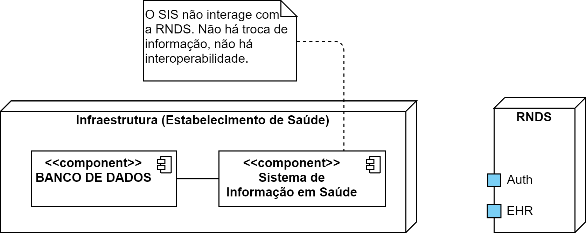
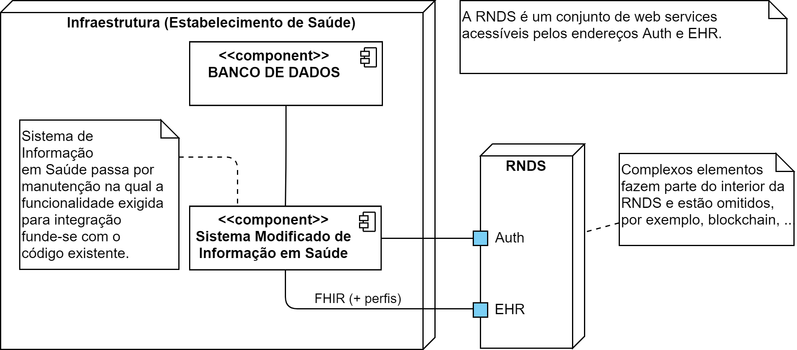
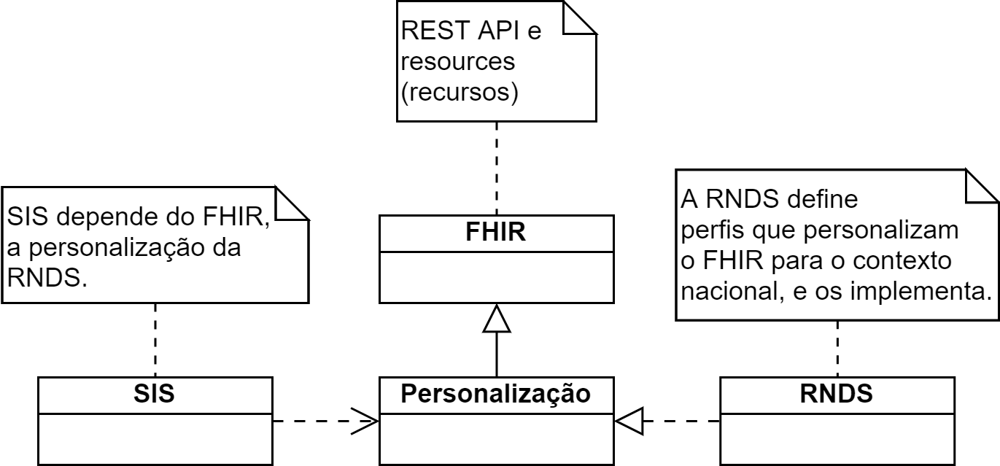
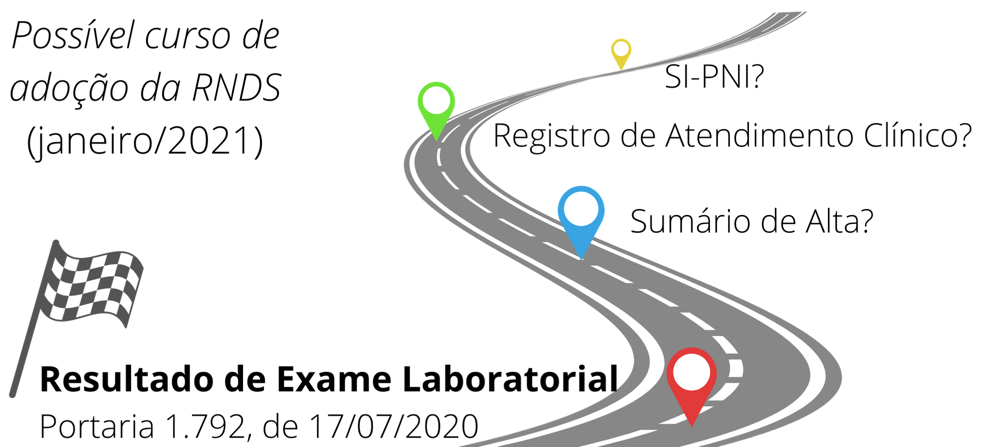
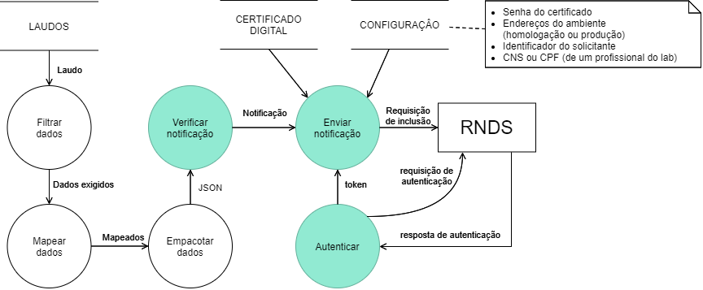
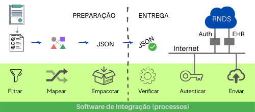
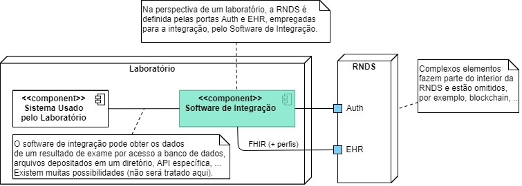

Conector é o nome dado à solução tecnológica que acessa a RNDS. É este software que precisa ser desenvolvido e, de fato, o que implementa a troca de informação em saúde com a RNDS.
Por exemplo, envia resultado de exame laboratorial de um laboratório para a RNDS.

As seções seguintes apresentam questões típicas da integração com a RNDS por meio do desenvolvimento de um conector de referência. Isto é feito de forma abstrata e flexível o suficiente para que possa servir de orientação para vários estabelecimentos de saúde interessados na integração com a RNDS.

### Sistema de Informação em Saúde (SIS)

Um estabelecimento de saúde usa, em geral, um Sistema de Informação em Saúde (SIS) para auxiliar na gestão das suas demandas, usuários, profissionais de saúde, procedimentos e laudos, por exemplo.

Pode-se representar todo e qualquer Sistema de Informação em Saúde (SIS) como a união de dois componentes: (a) um Banco de Dados, no qual informações administrativas e outras de saúde são armazenadas; e (b) o software propriamente dito do SIS. Esta organização abstrata é suficiente para identificar o que é denominado de software de integração.

Usando esta abstração, a ausência de interoperabilidade do SIS com outro sistema, não há software de integração e, consequentemente, não há integração com a RNDS.

### Após a integração

A integração exige a existência do software de integração (conector).
A implementação das funções atribuídas a este software pode assumir
várias formas. Duas delas, relevantes para o contexto, são apresentadas abaixo.

Na primeira, o SIS empregado pelo laboratório passa por uma manutenção na qual o software de integração (conector) é fundido ao SIS existente. O SIS, agora modificado, torna-se um SIS que interage com a RNDS.

Na segunda, um componente específico reúne as funções necessárias para a integração com a RNDS. Neste caso, o Conector é encarregado de obter as informações em saúde a serem transferidas, possivelmente acessando diretamente o Banco de Dados.

Convém esclarecer que estas duas formas de integração não são as únicas e a integração com a RNDS não impõe exigências na organização do SIS em questão, conforme elucidado abaixo.

## Contexto

Padrões são amplamente empregados, por exemplo, a extensão (ou cumprimento) atribuído a um metro ou o tamanho de uma folha de papel A4. No Brasil, não faz muito tempo que o formato de tomadas elétricas foi padronizado. A intenção é fazer com que seus aparelhos possam se conectar à rede elétrica. De forma análoga, para que um SIS possa trocar informações em saúde é preciso um padrão.
Neste sentido, a Portaria 1.434, de 28/05/2020 do Ministério da Saúde presta serviço análogo ao da norma ABNT NBR 14136:2012, que define o padrão nacional de tomadas.

®Health Level Seven, HL7 e FHIR são marcas registrada da Health Level
Seven International. Estas marcas são usadas com a permissão da HL7 e este uso não
significa que a HL7 aprova ou endossa o presente Guia.

### Independência

Um estabelecimento de saúde integra-se à RNDS por meio do Sistema de Informação em Saúde (SIS) que utiliza. Ou seja, a integração ocorre por meio de software (conector), que usa o padrão FHIR, adotado pelo Brasil, para tal. No momento certo os detalhes deste padrão são apresentados.

Usar o padrão adotado pelo Brasil significa empregar uma API e esquemas de dados bem estabelecidos para transferir e obter informações em saúde no território nacional. Adicionalmente, reconhecendo a impossibilidade de contemplar as especificidades e os interesses locais de todo o planeta, o padrão inclui instrumentos para "personalização", como _perfis_ e _extensões_, o que resultam em uma adaptação.

O software de um SIS e a RNDS são “independentes”, podem evoluir independentemente, podem fazer uso de tecnologias distintas, linguagens de programação distintas e sistemas operacionais distintos.

A integração é assegurada se o SIS e a RNDS estão conectados à internet e obedecem o contrato ou personalização nacional (adaptação). Nenhum deles depende ou impõe restrições ao outro.

## Desenvolvimento de referência

Antes do início de desenvolvimento do conector, é razoável uma análise das funcionalidades a serem contempladas, bem como de oções de _design_. Naturalmente, tendo em vista as especificidades de cada cenário de integração, único por estabelecimento de saúde, não é factível definir uma análise e um _design_ adequados para todos eles, contudo, isto não impede uma investigação preliminar, que ofereça uma orientação para integradores.

### Especificação

#### Escopo

O conector, como qualquer outro software, visa atender alguma demanda. Para o desenvolvimento de referência tal demanda (escopo) é a Portaria 1.792, que determina a obrigatoriedade de notificação de resultados de exame da COVID-19.

Convém observar que a notificação de laudo de COVID-19 é a primeira necessidade de troca de informação contemplada pela RNDS. Ao longo do tempo, outras necessidades serão incluída, como o Sumário de Alta (SA) e o Registro de Atendimento Clínico (RAC), por exemplo. À medida que novas necessidades de integração forem implementadas pela RNDS, mais informações em saúde e outros tipos de estabelecimentos de saúde estarão envolvidos.

#### Requisitos

Toda a integração no escopo identificado acima pode ser suficientemente representada por dois casos de uso: _Obter token de acesso_ e _Enviar resultado de exame_. Respectivamente cobrindo a segurança e uma necessidade de interoperabilidade em saúde.

Apesar do desenvolvimento de referência ter como foco estes dois casos de uso, de interesse de laboratórios, eles capturem o que é relevante e provavelmente será necessário em toda e qualquer integração.

##### Obter token de acesso

##### Enviar resultado de exame

Na perspectiva de processos (funções) e do fluxo de informações entre eles, o diagrama correspondente é fornecido abaixo. Aqueles destacados estão diretamente associados aos casos de uso identificados acima, ou seja, fazem parte do escopo a ser implementado. Os demais processos (funções) são necessários, mas ao mesmo tempo, dependentes do ecossistema do laboratório.

Cada função é definida e classificada quanto à fase em que é executada (preparação ou entrega).

- PREPARAÇÃO

  1.  **Filtrar**. Seleciona os dados de um resultado de exame a partir dos quais aqueles exigidos pela RNDS serão produzidos.
  1.  **Mapear**. Realiza a conversão e/ou mapeamento necessário entre os dados selecionados (filtrados) e aqueles no formato exigido pela RNDS.
  1.  **Empacotar**. Cria a representação JSON dos dados correspondentes a um
      resultado.

- ENTREGA
  1.  **Verificar**. Confere se o empacotamento do resultado a ser enviado está consistente com especificação da RNDS.
  1.  **Autenticar**. Obtém chave para acesso aos serviços da RNDS.
  1.  **Enviar**. Notifica o resultado de um exame à RNDS.

A figura abaixo ilustra os processos e a classificação deles, além de indicar que dois processos, via internet, interagem com as portas Auth e EHR, oferecidas pela RNDS. Detalhes são fornecidos em [Ambientes](rnds/ambientes).

### Design

Dentre as funções atribuídas ao _Software de Integração_, ao todo seis, conforme seção anterior, duas delas não são contempladas aqui: (a) filtrar e (b) mapear. Estas funções são bem específicas e dependentes do ecossistema disponível no laboratório.

Na perspectiva de implantação (_deployment_), a figura abaixo
ilustra uma possível organização do ecossistema de software
utilizado por um laboratório, e sua integração com a RNDS.

Na figura, _Software de integração_ é
um componente isolado, distinto de um "Sistema Usado pelo Laboratório".
Em um dado laboratório, contudo, pode não existir um "Sistema Usado pelo Laboratório", ou até existir, mas a TI do laboratório propor um _design_ distinto no qual as funções aqui atribuídas ao _Software de Integração_
seriam incorporadas pelo "Sistema Usado pelo Laboratório".

Adicionalmente, se esta figura, por acaso, reflete parte do _design_ adotado por algum laboratório, ainda existem vários detalhes omitidos e relevantes para
o _design_ da integração. Por exemplo, a forma de obtenção dos dados
pertinentes aos resultados de exames e atualmente mantidos pelo "Software Usado pelo Laboratório", conforme nota pertinente na figura acima.

> IMPORTANTE: a figura acima, embora possa inspirar o _design_ da
> integração de um laboratório com a RNDS, apenas registra uma possibilidade cujo objetivo é orientar desenvolvedores de software acerca de questões pertinentes à tal integração.

### Implementação

A construção do código do Software de Integração pode se beneficiar das [bibliotecas](rnds/tools/bibliotecas) disponibilizadas para compreensão acerca de como implementar a submissão de requisições para a RNDS.
