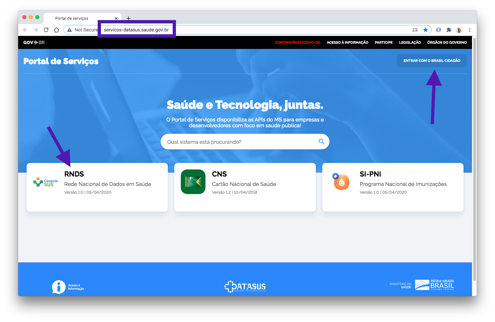
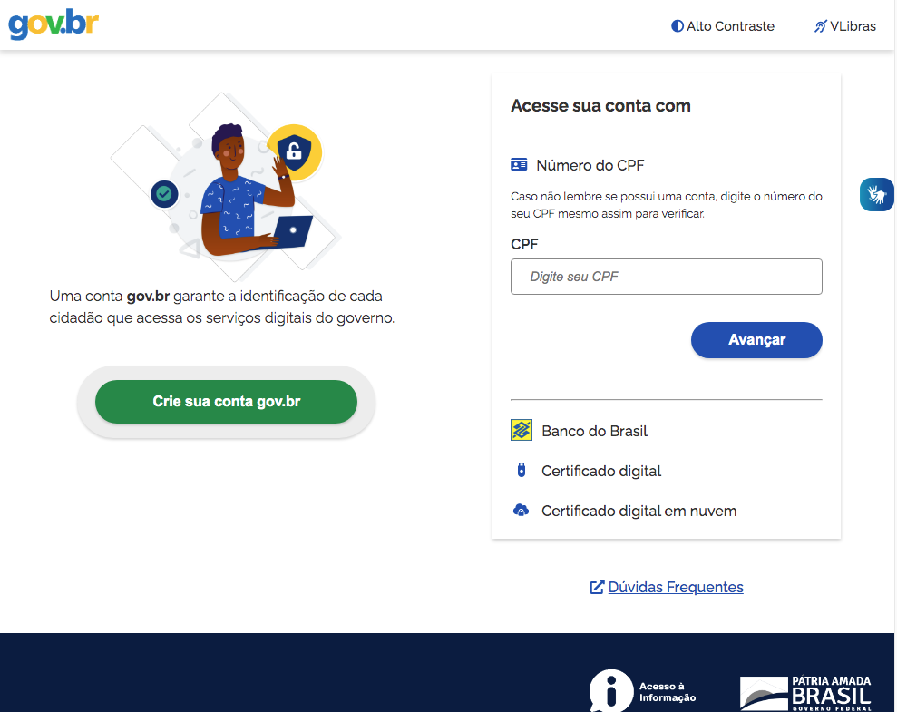

O Portal de Serviços, https://servicos-datasus.saude.gov.br/, é um catálogo de _web services_ e APIs para integração com a RNDS e outros sistemas do Ministério da Saúde (MS). É por meio do portal de serviços que a solicitação de acesso à RNDS é feita.

A página do Portal de Serviços é exibida abaixo, com destaque para o endereço na parte superior, https://servicos-datasus.saude.gov.br, o botão ENTRAR COM O BRASIL CIDADÃO (lado direito) e a opção pertinente à RNDS (lado esquerdo).

Para solicitar o acesso aos serviços da RNDS é necessário selecionar o ícone do serviço RNDS (opção esquerda destacada na figura acima). Quando selecionado, a página destino é exibida abaixo, contendo vários tópicos como contexto, objetivo, e outros, dentre os quais o botão "Solicitar acesso". 

Quando o botão "Solicitar acesso" (veja ilustração acima) é pressionado, a página resultante é a página do [gov.br](https://acesso.gov.br). Esta página é a mesma se o botão ENTRAR COM O BRASIL CIDADÃO, comentado acima, for acionado na primeira página. Para entrar é necessário que o gestor acesse sua conta gov.br. Se for o caso, veja detalhes acerca de como [criar a conta gov.br](./gov.br.md)

### Etapas da solicitação

A solicitação de acesso exige o fornecimento de várias informações, distribuídas em etapas (Responsável, Sistema, Operação e Finalização), conforme ilustrado abaixo. Observe que as tarjas azuis na parte superior ocultam a identificação do usuário gov.br em questão.

Conforme ilustrado acima, a primeira informação a ser fornecida, da primeira etapa, indica se a solicitação é interna ao Ministério da Saúde ou não. Na ilustração, a opção
"Outros" encontra-se selecionada, indicando que a solicitação não é interna, mas tem como origem um estabelecimento de saúde fora do Ministério da Saúde.

