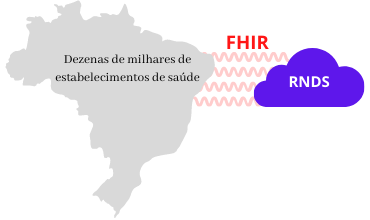
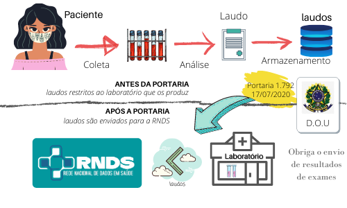
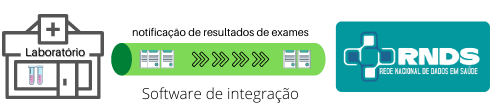

Na perspectiva de um estabelecimento de saúde, a Rede Nacional de Dados em Saúde (RNDS) oferece serviços
para a interoperabilidade em saúde no território nacional. No Brasil, é por meio da RNDS que um estabelecimento em saúde disponibiliza informação que será consumido por outro.

Quando um estabelecimento de saúde se integra à RNDS, cria-se a possibilidade dele contribuir com informações em saúde pertinentes aos usuários que assiste,
bem como consumir informações geradas por outros estabelecimentos.

Conforme ilustrado abaixo, a integração com a RNDS segue o padrão [FHIR](./glossario#fhir). Isso significa "independência do estabelecimento de saúde" em relação à tecnologia e ao seu ecossistema. Noutras palavras, a RNDS não impõe, não restringe e nem tampouco orienta decisões do estabelecimento de saúde.

Em algum momento, contudo, requisições _https_, obedecendo o padrão FHIR e a [adaptação](./rnds/definicoes) definida pela RNDS, devem partir do estabelecimento de saúde e atingir o [ambiente](./rnds/ambientes) de produção da RNDS, seja para enviar ou requisitar informação em saúde.

A interoperabilidade, no momento, contempla a notificação de resultados de exames de SARS-CoV-2. O conjunto será estendido ao longo do tempo, contudo,
tendo em vista a adoção do padrão FHIR, integrar para notificar um resultado de exame é "similar" à submissão de um Registro de Atendimento Clínico (RAC)
ou Sumário de Alta (SA), dentre outros.

## O que muda?

Em um cenário convencional, sem a integração com a RNDS, laudos produzidos permanecem restritos ao sistema de software do laboratório em questão.
Em algum momento são enviados para uma base de dados segura, e tornam-se inacessíveis até aos pacientes.

A informação em saúde, contudo, "precisa chegar onde é necessária". A [Portaria 1.792, de 17 de julho de 2020](https://www.in.gov.br/en/web/dou/-/portaria-n-1.792-de-17-de-julho-de-2020-267730859), do Ministério da Saúde,
é um marco histórico neste sentido. Essa portaria estabelece a obrigatoriedade de notificar o Ministério da Saúde acerca dos resultados de testes de SARS-CoV-2 produzidos em todo o território nacional.

A figura abaixo ilustra o envio de laudos de um laboratório para a RNDS, como consequência desta Portaria.

Na prática isso significa que cada laboratório terá que produzir _software_ para a sua integração com a RNDS. Noutras palavras, _software_ que envia o resultado de cada exame que produz para o Ministério da Saúde (veja a ilustração abaixo).

## Este Guia

O **Guia de Integração RNDS** tem como compromisso identificar todos
os passos necessários, orientações e outras informações, sejam administrativas ou técnicas, para _facilitar a integração com a RNDS_.

O objetivo orientar estabelecimentos de saúde acerca da integração com a RNDS. Esta integração é ilustrada pela notificação obrigatória de resultados de exames (SARS-CoV-2) ao Ministério da Saúde pelos laboratórios em território nacional.

Dois papéis definem o [público-alvo](./publico-alvo/publico-alvo) deste _Guia_: (a) gestor (responsável pelo laboratório) e (b) integrador (desenvolvedor).

> A integração entre estabelecimentos de saúde e a RNDS (Ministério da Saúde) é o foco deste guia. Os exemplos são baseados no envio de lados de COVID-19 de Laboratórios de Análises Clínicas para a RNDS.
