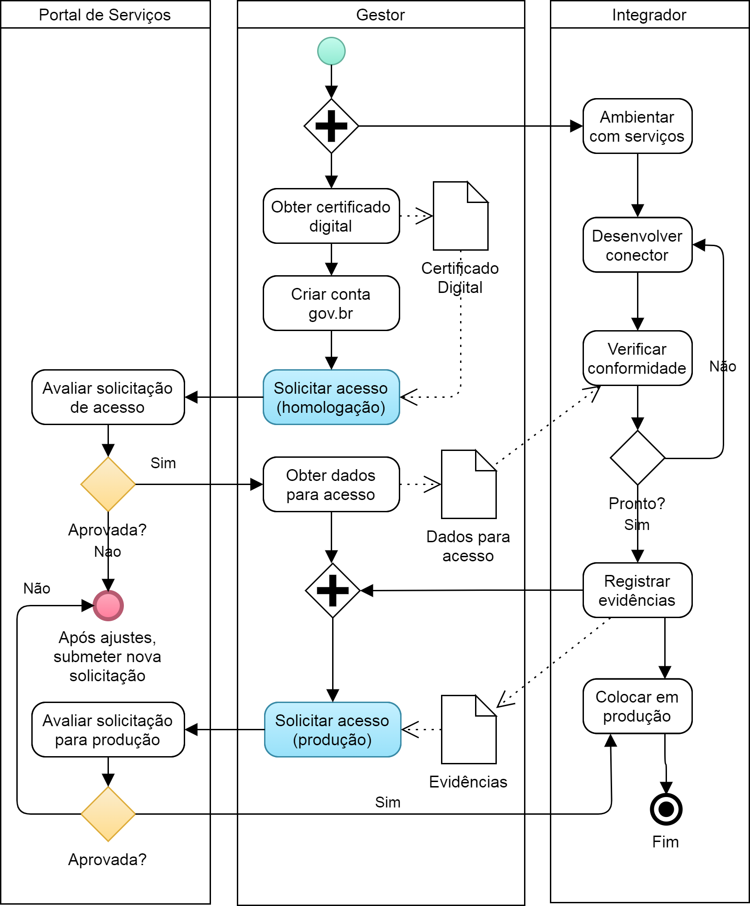

O processo de credenciamento de um estabelecimento de saúde
junto à RNDS é realizado em dois passos. No primeiro o estabelecimento requisita acesso ao ambiente de homologação. No segundo, o estabelecimento requisita acesso ao ambiente de produção. Quando este último é
concedido, o estabelecimento está autorizado a trocar informações com a RNDS.

Os detalhes destes passos em um fluxo típico, aderente a muitos cenários, é fornecido abaixo. Variações neste fluxo são naturais, até porque a maioria das atividades é realizada pelo gestor e o integrador, ou seja, pelo estabelecimento. A intenção, convém mencionar, não é impor um processo, mas mostrar como o credenciamento pode ser obtido.

Fluxo típico:

1. O gestor deve obter o [certificado digital](../gestor/certificado).
1. O gestor deve [criar uma conta gov.br](../gestor/gov.br), caso não possua uma.
1. O gestor deve [solicitar acesso](../gestor/portal) à RNDS, e aguardar a resposta do DATASUS.
1. O gestor deve obter o [identificador do solicitante](../gestor/identificador) após a aprovação da solicitação de acesso pelo DATASUS.
1. O profissional de TI deve [interagir](../ti/conhecer) com os serviços (entradas/saídas) oferecidos e, dessa forma, conhecê-los e compreendê-los.
1. O profissional de TI deve [desenvolver](../ti/si) o software necessário para a integração com a RNDS.
1. O profissional de TI deve produzir as evidências necessárias para [homologar](../ti/homologar) a integração implementada pelo software desenvolvido (passo anterior).
1. O gestor deve solicitar acesso ao ambiente de produção e aguardar a resposta do DATASUS.
1. O profissional de TI deve [colocar em produção](../ti/producao) o software que realiza a integração entre o estabelecimento de saúde e a RNDS (e homologado no passo anterior).

