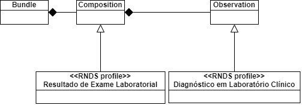

Objetivo:

> Detalhar itens de dado necessários para registrar um Resultado de Exame Laboratorial. A representação JSON de um resultado completo pode ser obtido AQUI.

Resultados esperados:

- Você saberá quais são os dados necessários para montar um resultado de exame de SARS-CoV-2-19.
- Você saberá como estes dados devem ser fornecidos no documento JSON exigido pela RNDS.
- Você será capaz de montar um documento JSON para refletir o resultado de um dado exame.

### Bundle (estrutura)

O resultado de exame laboratorial, por exemplo, o resultado do exame de SARS-CoV-2-19, é definido por meio de um recurso [Composition](https://www.hl7.org/fhir/composition.html), que referencia um recurso [Observation](https://www.hl7.org/fhir/observation.html) que, por fim, faz uso de um tercerio recurso FHIR, o [Specimen](https://www.hl7.org/fhir/specimen.html). Todos estes três recursos são necessários.

Estes três recursos FHIR não são usados conforme definidos, mas por meio de personalizações
para atender o contexto nacional. Uma personalização é definida por um perfil (_profile_).
Respectivamente, os perfis definidos pela RNDS são [Resultado
de Exame Laboratorial](https://simplifier.net/redenacionaldedadosemsade/brresultadoexamelaboratorial) (_Composition_), [Diagnóstico em Laboratório Clínico](https://simplifier.net/RedeNacionaldeDadosemSade/BRDiagnosticoLaboratorioClinico) (_Observation_) e, por fim, [Amostra Biológica](https://simplifier.net/RedeNacionaldeDadosemSade/BRAmostraBiologica) (_Specimen_).

Adicionalmente, um quarto recurso é necessário para compor um resultado de exame laboratorial, um recurso que reúne os outros três comentados acima. O recurso FHIR [Bundle](https://www.hl7.org/fhir/bundle.html) foi definido especificamente para reunir recursos FHIR. Vários recursos FHIR podem ser agrupados em um [Bundle](https://www.hl7.org/fhir/bundle.html).
Dito de outra forma, [Bundle](https://www.hl7.org/fhir/bundle.html) é um contêiner de recursos FHIR.

Feitas tais considerações,
o diagrama UML abaixo esclarece que um _Bundle_ é o "envelope" ou "pacote" no qual é depositado um resultado de exame laboratorial, que inclui um diagnóstio em laboratório clínico que, por sua vez, faz uso de uma amostra biológica.



Todo recurso FHIR pode ser representado em JSON. A propriedade _resourceType_
é obrigatória e identifica o tipo de recurso. Para um recurso
do tipo _Bundle_ o valor desta propriedade é "Bundle", conforme ilustrado
no "esqueleto" de JSON abaixo.

```json
{
   "resourceType":"Bundle",
   "type":"document",
   "timestamp":"2020-03-20T00:00:00-03:00",
   "meta": {
      "lastUpdated": "2020-03-20T00:00:00-03:00"
   },
   "identifier":{ ... omitido ... },
   "entry":[
      { ... Resultado de Exame Laboratorial ... },
      { ... Diagnóstico em Laboratório Clínico ... },
      { ... Amostra Biológica ... }
    ]
}
```

A propriedade _type_ indica o propósito do _Bundle_, no caso, trata-se de um documento (_document_). A propriedade _timestamp_ indica o instante em que o _Bundle_ foi criado,
provavelmente o mesmo instante da última atualização, fornecida na propriedade _meta.lastUpdate_.

As outras duas propriedades do "esqueleto" são _identifier_ e _entry_, justamente aquelas cujos valores foram omitidos, mas que são detalhadamente fornecidos nas seções seguintes.

Em particular, a propriedade _entry_ é o motivo da existência de um [Bundle](https://www.hl7.org/fhir/bundle.html). Exatamente por meio desta propriedade são definidos os recursos FHIR que fazem parte do _Bundle_. Neste caso,
o [Resultado de Exame Laboratorial](https://simplifier.net/redenacionaldedadosemsade/brresultadoexamelaboratorial), o [Diagnóstico em Laboratório Clínico](https://simplifier.net/RedeNacionaldeDadosemSade/BRDiagnosticoLaboratorioClinico) e
a [Amostra Biológica](https://simplifier.net/RedeNacionaldeDadosemSade/BRAmostraBiologica).

Quem desejar consultar o JSON completo, já "inflado" com os valores para estas propriedades, antes de percorrer as seções seguintes, pode obtê-lo [aqui](https://raw.githubusercontent.com/kyriosdata/rnds/master/projetos/exemplos/SARS-CoV-2-01.json).

### Bundle (_identifier_)

O identificador (_identifier_) do _Bundle_ é montado a partir de dois valores, o identificador do solicitante e o identificador do resultado, respectivamente representados abaixo por {{lab-identificador}} e {{exame-id-lab}}:

```json
"identifier": {
    "system": "http://www.saude.gov.br/fhir/r4/NamingSystem/BRRNDS-{{lab-identificador}}",
    "value": "{{exame-id-lab}}"
}
```

O identificador do solicitante, representado acima por {{lab-identificador}}, é fornecido pela RNDS quando o pedido de solicitação de acesso à RNDS é aprovado. Consulte[identificador do solicitante](../gestor/identificador) para detalhes.

O identificador do resultado de exame, por outro lado, é um identificador criado pelo laboratório para unicamente identificar o resultado em questão. Quaisquer dois resultados produzidos pelo laboratório devem, necessariamente, possuir identificadores distintos.

O laboratório pode optar por criar identificadores sequenciais, por exemplo, "1", "2", e assim por diante. Ou ainda, "2020-09-04-0001", "2020-09-04-0002" e assim sucessivamente, para resultados produzidos em um determinado dia.

Também pode gerar um identificador universalmente único (_Universally Unique IDentifier_) ou [UUID](https://en.wikipedia.org/wiki/Universally_unique_identifier). Veja como podem ser gerados em [Java](https://www.baeldung.com/java-uuid) e [JavaScript](https://www.npmjs.com/package/uuid), por exemplo.

De posse tanto do identificador do solicitante, por exemplo, "99", quanto do identificador de um resultado de exame a ser enviado para a RNDS, digamos "04/09/2020-cdYQj", o trecho do JSON correspondente à propriedade _identifier_ do _Bundle_ a ser enviado para a RNDS, seria

```json
"identifier": {
    "system": "http://www.saude.gov.br/fhir/r4/NamingSystem/BRRNDS-99",
    "value": "04/09/2020-cdYQj"
}
```

Em consequência, o "esqueleto" JSON pode ser reescrito, considerando o preenchimento do _identifier_, conforme abaixo:

```json
{
   "resourceType":"Bundle",
   "type":"document",
   "timestamp":"2020-03-20T00:00:00-03:00",
   "meta": {
      "lastUpdated": "2020-03-20T00:00:00-03:00"
   },
   "identifier": {
      "system": "http://www.saude.gov.br/fhir/r4/NamingSystem/BRRNDS-99",
      "value": "04/09/2020-cdYQj"
   },
   "entry":[
      { ... Resultado de Exame Laboratorial ... },
      { ... Diagnóstico em Laboratório Clínico ... },
      { ... Amostra Biológica ... }
    ]
}
```

### Bundle (_entry_)

Um _Bundle_ é empregado para reunir recursos FHIR, e _entry_, destacada abaixo, é a propriedade onde os recursos devem ser fornecidos, observe que é um _array_. No caso em questão, este _array_ deve possuir três entradas:

```json
"entry":[
   { ... Resultado de Exame Laboratorial ... },
   { ... Diagnóstico em Laboratório Clínico ... },
   { ... Amostra Biológica ... }
 ]
```

Estas três entradas, respectivamente, referem-se aos seguintes perfis definidos pela RNDS: [Resultado de Exame Laboratorial](https://simplifier.net/redenacionaldedadosemsade/brresultadoexamelaboratorial), [Diagnóstico em Laboratório Clínico](https://simplifier.net/RedeNacionaldeDadosemSade/BRDiagnosticoLaboratorioClinico) e
[Amostra Biológica](https://simplifier.net/RedeNacionaldeDadosemSade/BRAmostraBiologica).

Observe que estes recursos são fornecidos em entradas próprias da propriedade _entry_, ou seja, não estão "aninhadas", apesar da amostra biológica ser empregada pelo diagnóstico que, por sua vez, faz parte do resultado de exame laboratorial.

A "conexão" entre recursos é realizada por meio de referências, que são amplamente empregadas quando se uso o padrão FHIR.

### Referências entre recursos

O FHIR faz uso extensivo do conceito de [referência](https://www.hl7.org/fhir/references.html). Ou seja, muitos dos elementos que compõem um recurso são referências para outros recursos. Dito de outra forma,
em vez do diagnóstico em laboratório clínico (_Observation_) ser fornecido "embutido" em um resultado de exame laboratorial (_Composition_), este último recurso referencia (aponta para) o recurso que é o diagnóstico (_Observation_).

Em geral, em um conjunto de recursos FHIR há referências entre os recursos, formando uma rede de informação em saúde. Conforme ilustrado abaixo, a rede para um resultado de exame laboratórial é formada por três recursos, entre os quais há duas referências. O recurso Resultado possui uma referência para Diagnóstico que, por sua vez, referencia o recurso Amostra.


Convém reiterar por meio de mais um exemplo. A amostra biológica (_Specimen_) é parte de um diagnóstico (_Observation_), contudo, esta parte (_Specimen_) é fornecida em sua própria entrada em _entry_, e referenciada pelo diagnóstico (_Observation_) que a utiliza.

A propriedade _entry_ de um _Bundle_ é fornecida no trecho abaixo para ressaltar a localização e compreensão do emprego de referências entre recursos FHIR. Cada entrada do _array_ possui o seu endereço ou identificador único definido pela propriedade _fullUrl_, e o recurso propriamente dito (_resource_), apenas parcialmente fornecido. Cada recurso possui o seu próprio _resourceType_ e, portanto, sabe-se que os três recursos fornecidos no _Bundle_ são um _Composition_, um _Observation_ e, por fim, um _Specimen_. Adicionalmente, a primeira entrada do _array_, recurso _Composition_, referencia a segunda entrada, dado que a propriedade _reference_ indica o _fullUrl_ da segunda entrada e, de forma similar, esta segunda entrada referencia a terceira, que não possui referência para outro recurso.

```json
"entry": [
   {
      "fullUrl": "urn:uuid:transient-0",
      "resource": {
        "resourceType": "Composition",
        ... "reference": "urn:uuid:transient-1" ...
   },
   {
      "fullUrl": "urn:uuid:transient-1",
      "resource": {
        "resourceType": "Observation",
         ... "reference": "urn:uuid:transient-2" ...
      }
   },
   {
      "fullUrl": "urn:uuid:transient-2",
      "resource": {
        "resourceType": "Specimen"
        ... outras propriedades (mas não há 'reference')...
      }
   }
]
```

Observe novamente, no trecho acima, como é estabelecida a referência entre recursos. Na segunda entrada do _array_, _Observation_, há uma referência (_reference_) para a terceira entrada cujo identificador é "urn:uuid:transient-2".

Tendo em vista que os recursos que definem um resultado de exame laboratorial foram identificados ([Resultado de Exame Laboratorial](https://simplifier.net/redenacionaldedadosemsade/brresultadoexamelaboratorial), [Diagnóstico em Laboratório Clínico](https://simplifier.net/RedeNacionaldeDadosemSade/BRDiagnosticoLaboratorioClinico) e
[Amostra Biológica](https://simplifier.net/RedeNacionaldeDadosemSade/BRAmostraBiologica)), e que cada um deles é fornecido em entrada própria na propriedade _entry_ (conforme ilustrado acima), e que a ligação entre eles é estabelecida por meio de referências, é preciso prosseguir e preencher cada um destes recursos. Novamente, o JSON completo está disponível [aqui](https://raw.githubusercontent.com/kyriosdata/rnds/master/projetos/exemplos/SARS-CoV-2-01.json).

### Resultado de Exame Laboratorial

Um resultado de exame no Brasil é definido pela RNDS por meio do perfil [Resultado de Exame Laboratorial](https://simplifier.net/redenacionaldedadosemsade/brresultadoexamelaboratorial). Este perfil é uma personalização do recurso [Composition](https://www.hl7.org/fhir/composition.html). Conforme o perfil, um resultado é caracterizado por várias propriedades, cada uma delas comentada abaixo.

_status_. Para efeito de um resultado o valor a ser utilizado é "final".

_type_. Identifica o tipo do documento por meio da propriedade _coding_, que é um _array_, neste caso, de uma entrada apenas e obrigatória. O objeto correspondente a tal entrada possui duas propriedades, _system_ e _code_.
A primeira define o conjunto de valores possíveis, neste caso, o [Tipo de Documento](https://simplifier.net/RedeNacionaldeDadosemSade/BRTipoDocumento). A segunda, um dos valores possíveis. Dentre eles há "REL", que representa "Resultado de Exame(s) Laboratorial(is)". Em consequência, esta propriedade é definida conforme abaixo:

```json
"type": {
   "coding": [
      {
        "system": "http://www.saude.gov.br/fhir/r4/CodeSystem/BRTipoDocumento",
        "code": "REL"
      }
   ]
},
```

_subject_. O indivíduo ao qual está associado o resultado de exame. A identificação é fornecida pelo objeto _identifier_, que possui duas propriedades, _system_ e _value_. O primeiro possui um valor fixo "http://www.saude.gov.br/fhir/r4/StructureDefinition/BRIndividuo-1.0". O segundo, _value_, é o CNS (Cartão Nacional de Saúde) do indivíduo. Abaixo segue a representação desta propriedade na qual, em vez do CNS de um indivíduo, é fornecida a sequência "{{individuo-cns}}".

```json
"subject": {
    "identifier": {
        "system": "http://www.saude.gov.br/fhir/r4/StructureDefinition/BRIndividuo-1.0",
        "value": "{{individuo-cns}}"
    }
},
```

_date_. Data e hora em que o documento foi gerado, por exemplo, "2020-03-20T00:00:00-03:00".

_author_. Identifica a pessoa física ou a pessoa jurídica responsável pelo conteúdo ou autoria do documento. A estrutura deste objeto é similar àquela de _subject_, fornecida acima. À semelhança de cenários anteriores, o trecho
JSON abaixo substitui o valor de um CNES pela sequência "{{lab-cnes}}".

```json
"author":[
   {
      "identifier":{
         "system":"http://www.saude.gov.br/fhir/r4/StructureDefinition/BRPessoaJuridicaProfissionalLiberal-1.0",
         "value":"{{lab-cnes}}"
      }
   }
],
```

_title_. O título do documento é o valor fixo "Resultado de Exame Laboratorial".

_relatesTo_. Esta propriedade, conforme a documentação do perfil, deve ser utilizado exclusivamente
para indicar que este documento substitui (_replaces_) outro documento. Seu uso, portanto, está
definido para indicar que o presente documento substitui um anterior. Conforme a documentação,
o documento substituído continuará disponível na RNDS e poderá ser recuperado integralmente
por meio do identificador a ele atribuído pela RNDS, contudo, não estará diretamente disponível
na linha do tempo do cidadão. Esta propriedade será detalhada na definição do serviço
_Substituir resultado de exame_.

_section_. Define as seções empregadas pelo resultado (documento). Neste caso há uma única seção na qual
é registrado o [Diagnóstico em Laboratório Clínico](https://simplifier.net/RedeNacionaldeDadosemSade/BRDiagnosticoLaboratorioClinico). Ou seja, a única seção é um recurso FHIR, um _Observation_ e,
para ser ainda mais preciso, o perfil definido pela RNDS para registrar o diagnóstico de um
laboratório clínico. Em consequência, o valor desta propriedade é fixo e fornecido abaixo:

```json
"section": [
    {
        "entry": [
            {
                "reference": "urn:uuid:transient-1"
            }
        ]
    }
]
```

### Diagnóstico em Laboratório Clínico (recurso)

O perfil [Diagnóstico em Laboratório Clínico](https://simplifier.net/RedeNacionaldeDadosemSade/BRDiagnosticoLaboratorioClinico) detalha um exame ou teste realizado em laboratório com finalidade
diagnóstica ou investigativa. Este perfil é uma personalização do recurso [Observation](https://www.hl7.org/fhir/observation.html). As propriedades são definidas abaixo.

_status_. Define o [Estado da Observação](https://simplifier.net/RedeNacionaldeDadosemSade/BREstadoObservacao-1.0-duplicate-2). São dois valores possíveis: "final" e "entered-in-error". Neste caso, o valor correto é "final", para indicar que o diagnóstio está concluído. A representação JSON correspondente é fornecida abaixo:

```json
"status": "final"
```

_category_. Classifica o exame ou teste utilizando um[Subgrupo da Tabela SUS](https://simplifier.net/RedeNacionaldeDadosemSade/BRSubgrupoTabelaSUS). Se o diagnóstico é por teste rápido, então o código correspondente é "0214". Ou seja, a propriedade _category_
para "Diagnóstico por teste rápido" é definida conforme abaixo:

```json
"category": [
    {
      "coding": [
       {
         "system": "http://www.saude.gov.br/fhir/r4/CodeSystem/BRSubgrupoTabelaSUS",
         "code": "0214"
       }
      ]
    }
],
```

_code_. Identifica o exame ou teste. Os valores são obtidos de códigos de [Nome do Exame](https://simplifier.net/RedeNacionaldeDadosemSade/BRNomeExame-1.0), que é formada pela união dos valores fornecidos na tabela [Exames LOINC](https://simplifier.net/RedeNacionaldeDadosemSade/BRNomeExameSARS-CoV-219LOINC) e códigos da tabela [Exames do GAL](https://simplifier.net/RedeNacionaldeDadosemSade/BRNomeExameSARS-CoV-219GAL). O trecho abaixo ilustra um
exame identificado pelo código LOINC correspondente, neste caso, "94507-1", que designa "SARS Coronavírus 2, [dosagem de] anticorpo IgG em soro ou plasma por imunoensaio".

```json
"code": {
    "coding": [
        {
            "system": "http://www.saude.gov.br/fhir/r4/CodeSystem/BRNomeExameLOINC",
            "code": "94507-1"
        }
    ]
},
```

_subject_. Identifica o indivíduo associado ao exame ou teste. O valor é o mesmo daquele fornecido anteriormente, para o [Diagnóstico em Laboratório Clínico](https://simplifier.net/RedeNacionaldeDadosemSade/BRDiagnosticoLaboratorioClinico). Em consequência, o trecho JSON correspondente, também com o mesmo propósito de não citar explicitamente um indivíduo, substitui o código CNS do indivíduo por "{{individuo-cns}}".

```json
"subject": {
    "identifier": {
        "system": "http://www.saude.gov.br/fhir/r4/StructureDefinition/BRIndividuo-1.0",
        "value": "{{individuo-cns}}"
    }
},
```

_issued_. Data/hora em que o resultado foi liberado. Este instante pode ser diferente daquele em
que o resultado é produzido e também diferente do instante em que o _Bundle_ foi produzido. Um exemplo é fornecido abaixo:

```json
"issued": "2020-09-10T10:49:10-03:00"
```

_performer_. Identifica o profissional e/ou estabelecimento de saúde responsável pelo resultado do exame. Observe que este responsável pode ser diferente do autor.

```json
"performer": [
    {
        "identifier": {
            "system": "http://www.saude.gov.br/fhir/r4/StructureDefinition/BRPessoaJuridicaProfissionalLiberal-1.0",
            "value": "{{lab-cnes}}"
        }
    }
],
```

_valueQuantity_. O valor do resultado quando este é quantitativo ([Quantity](https://www.hl7.org/fhir/datatypes.html#Quantity)). Se for qualitativo, então esta propriedade
não é fornecida e, no lugar dela, é empregada _valueCodeableConcept_.

_valueCodeableConcept_. O valor do resultado quando este é qualitativo ([CodeableConcept](https://www.hl7.org/fhir/datatypes.html#CodeableConcept)). Se o valor do resultado é quantitativo,
então a propriedade a ser utilizada deve ser _valueQuantity_. Neste caso, a propriedade _valueCodeableConcept_ não seria fornecida. No trecho JSON abaixo o resultado é qualitativo e o código obtido da tabela
[Resultado qualitativo do Exame](https://simplifier.net/RedeNacionaldeDadosemSade/BRResultadoQualitativoExame).

```json
"valueCodeableConcept": {
    "coding": [
        {
            "system": "http://www.saude.gov.br/fhir/r4/CodeSystem/BRResultadoQualitativoExame",
            "code": "3"
        }
    ]
},
```

_interpretation_. Interpretação qualitativa de um resultado quantitativo. Propriedade opcional e
particularmente útil quando se deseja esclarecer o resultado quantitativo do exame.

_note_. Comentários sobre os resultados dos exames. Propriedade também opcional.

_method_. O método empregado na realização do exame. Este objeto possui uma única propriedade, _text_. Abaixo
segue um trecho JSON correspondente:

```json
"method": {
    "text": "Imunocromatográfico"
}
```

_referenceRange_. De forma análoga à _method_ (acima), para o perfil em questão, esta propriedade (_array_) é definida por um único objeto de uma única propriedade, _text_, conforme ilustra o trecho abaixo.

```json
"referenceRange":
   [
       {
           "text": "(1) Detectável = presença de anticorpos; (2) Não detectável = ausência de anticorpos"
       }
   ]
```

_specimen_. Estabelece referência para o recurso [Specimen](https://www.hl7.org/fhir/specimen.html). Este recurso identifica a amostra empregada na realização do exame. Neste caso específico é uma referência para o perfil
[Amostra Biológica](https://simplifier.net/RedeNacionaldeDadosemSade/BRAmostraBiologica). Noutras palavras,
esta propriedade é a última do segundo recurso fornecido no _Bundle_ e que, em particular, referencia
o terceiro recurso, conforme ilustrado abaixo.

```json
"specimen": {
    "reference": "urn:uuid:transient-2"
}
```

### Amostra Biológica (recurso)

[Amostra Biológica](https://simplifier.net/RedeNacionaldeDadosemSade/BRAmostraBiologica) é um perfil de
[Specimen](https://www.hl7.org/fhir/specimen.html). Este perfil identifica a amostra de origem humana ou animal
usada em investigações biológicas/laboratoriais para fins diagnósticos.

Neste perfil, a única propriedade é _type_,
que identifica o [Tipo de Amostra de Exame](https://simplifier.net/RedeNacionaldeDadosemSade/BRTipoAmostra-1.0). Este tipo pode vir de duas tabelas (_code systems_) distintas. Uma delas é o [Tipo de Amostra Biológica](https://simplifier.net/RedeNacionaldeDadosemSade/BRTipoAmostraGAL) que, dentre os seus códigos se encontra
"SGHEM" para designar "sangue". Ou seja, se a amostra
biológica empregada pelo laboratório foi sangue, então o
trecho JSON correspondente é fornecido abaixo:

```json
"type": {
    "coding": [
        {
            "system": "http://www.saude.gov.br/fhir/r4/CodeSystem/BRTipoAmostraGAL",
            "code": "SGHEM"
        }
    ]
}
```

Embora a única propriedade do perfil seja _type_, ilustrado acima, todo recurso tem a propriedade _meta_, assim como _resourceType_. Tendo em vista que o recurso em questão é uma das entradas de um _Bundle_, toda a entrada é exibida abaixo:

```json
{
  "fullUrl": "urn:uuid:transient-2",
  "resource": {
    "resourceType": "Specimen",
    "meta": {
      "profile": [
        "http://www.saude.gov.br/fhir/r4/StructureDefinition/BRAmostraBiologica-1.0"
      ]
    },
    "type": {
      "coding": [
        {
          "system": "http://www.saude.gov.br/fhir/r4/CodeSystem/BRTipoAmostraGAL",
          "code": "SGHEM"
        }
      ]
    }
  }
}
```
