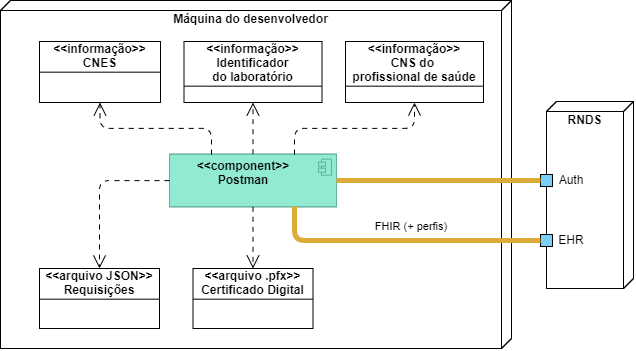
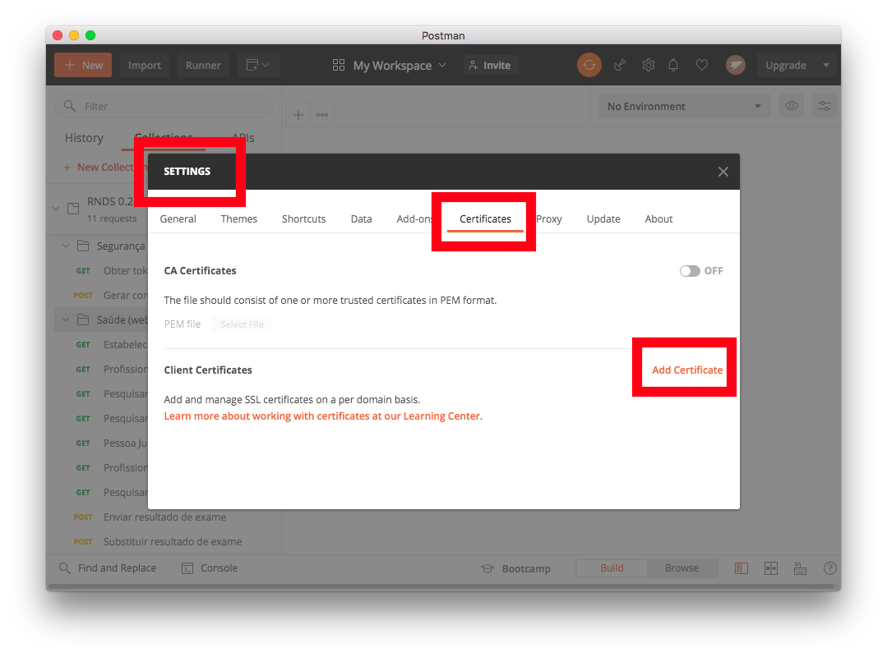
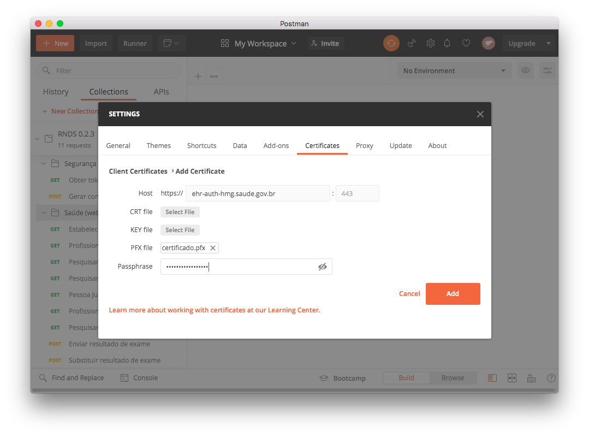
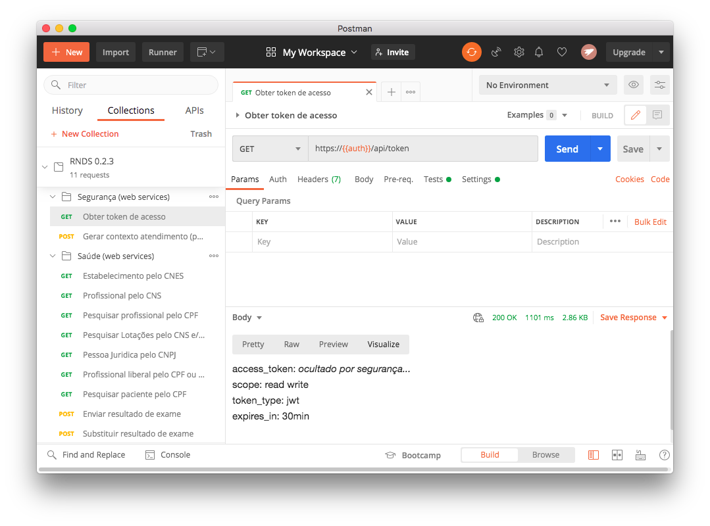
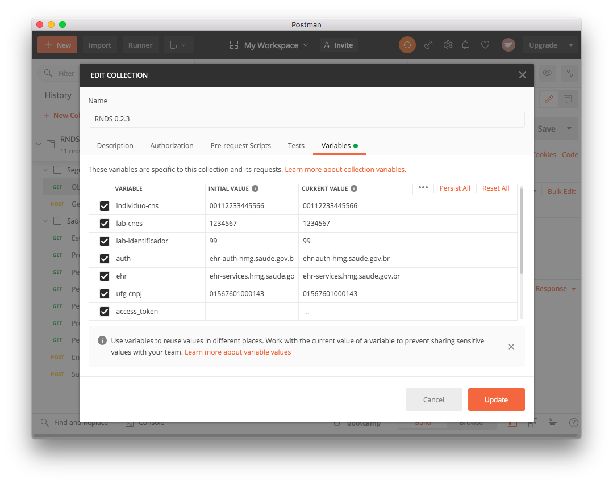

A integração via padrão FHIR e [perfis](../rnds/perfis) definidos pela RNDS, realiza-se por meio de requisições _https_ que devem partir do estabelecimento de saúde e atingir o [ambiente](./ambientes) de produção da RNDS (neste guia é feito uso do ambiente de homologação). 

> Neste documento é apresentado como submeter tais requisições. 

A submissão de requisições será feita por meio da ferramenta
[Postman](https://www.postman.com/downloads/) (empregada por desenvolvedores para interação com _web services_). Desta forma,
sem escrever uma única linha de código, detalhes das requisições podem consultados e o ambiente de homologação experimentado (portas Auth e EHR), o que é relevante para 
a produção de código correspondente.

Ao final, espera-se que:

- Você saiba quais são as requisições disponíveis.
- Você saiba quais são os _headers_ necessários e como montar os valores correspondentes.
- Você saiba quais os dados a serem enviados por cada requisição, ou [payload](../intro/glossario#payload).
- Você saiba submeter as requisições por meio da ferramenta Postman.
- Você saiba experimentar valores diferentes para o _payload_, _headers_ e observar os resultados.
- Você saiba interagir com a RNDS usando HTTPS.
- Você saiba empregar o certificado digital do laboratório.
- Você saiba como realizar as atividades acima empregando a linguagem de programção Java.
- Você esteja apto para construir o [Software de Integração](./si).

### Pré-requisitos
Conforme ilustrado na figura acima, o uso do Postman depende de três informações e dois arquivos:

- Informações necessárias:
  - [Identificador do solicitante](../gestor/identificador) fornecido pela RNDS quando a  [solicitação de acesso](../gestor/portal) é aprovada. Esta aprovação, além de definir o identificador do solicitante, também autoriza o acesso ao [ambiente de homologação](../rnds/ambientes).
  - CNES. O CNES do laboratório.
  - CNS de um profissional de saúde lotado no estabelecimento de saúde cujo CNES é fornecido acima. O CNS indica em nome do quem as requisições ao ambiente de homologação serão feitas.

- Arquivos necessários:
  - [Certificado digital](../gestor/certificado). O arquivo correspondente deve estar disponível, é um arquivo com a extensão **.pfx**, aqui será referenciado por **certificado.pfx**. Também será necessária a senha para acesso ao conteúdo do certificado.
  
  - Baixe o arquivo JSON ([collection](https://raw.githubusercontent.com/kyriosdata/rnds/master/tools/postman/rnds-postman-collection.json)), empregado pelo Postman, contendo as requisições a serem submetidas ao ambiente de homologação. Além das requisições este arquivo também contém a documentação de cada uma delas. A [documentação das requisições](https://documenter.getpostman.com/view/215332/TVCmT68w)(serviços) também pode ser consulta pela internet.

### Passos
De posse das informações e dos arquivos, veja seção anterior, pode-se configurar o Postman: (a) importar _collection_; (b) configurar certificado digital e (c) configurar variáveis.

### Importar _collection_

> Veja o vídeo acerca de como importar [aqui](https://drive.google.com/file/d/13hbA4uZlX_90wFt0ktCvkX2jBbhFkoDC/view)

Ao abrir o Postman você verá uma tela similar àquela abaixo, exceto que não terá o destaque para o botão `Import`, empregado para "importar" o arquivo baixado anteriormente:

Após importado, o resultado é similar àquele abaixo. A versão pode ser diferente, por exemplo. Observe que estão disponíveis 11 requisições, agrupadas naquelas de "Segurança" e "Saúde".

Neste ponto pode-se selecionar uma das requisições e, no canto superior direito, botão `Send` submeter aquela selecionada. Contudo, qualquer uma delas deve falhar, afinal,
não indicamos o certificado a ser empregado nem outras configurações necessárias.

### Configurar (certificado digital)

> Veja o vídeo acerca de como configurar o Postman com o certificado digital [aqui](https://drive.google.com/file/d/1V1mSYStqnEHNg0iznWhAnNBlX3jETe3o/view)

O Postman precisa ser configurado para usar o certificado digital do estabelecimento de saúde em questão, quando uma requisição for direcionada ao endereço empregado para autenticação do ambiente de homologação. 

Esta configuração é exigida para a correta execução do serviço denominado "Obter token de acesso". E o resultado desta requisição é necessário para a execução de todos os demais serviços. Em tempo, este é o único serviço que usa diretamente o certificado digital.

O serviço "Obter token de acesso" produz como resultado (retorno) o _token_ de acesso. Tal _token_ é exigido por todos os demais serviços. Ou seja, primeiro se obtém o _token_ de acesso, que tem validade por 30 minutos, e depois ele é reutilizado, neste período, em todas as demais requisições. Transcorridos os 30 minutos, será necessário uma nova requisição ao serviço "Obter token de acesso", para que um novo _token_, válido pelos próximos 30 minutos, possa ser reutilizado.

A indicação do certificado digital a ser utilizado pelo Postman é realizada da seguinte forma. Selecione _File_ (opção do _menu_), na sequência a opção _Settings_ e, por fim, abre-se a janela abaixo, na qual a aba _Certificates_ deve ser selecionada e, por último, _Add Certificate_.

Quando _Add Certificate_ é pressionado, abre-se tela similar àquela abaixo.
Observe que nenhum valor estará preenchido, ao contrário da tela exibida abaixo, na qual as três informações exigidas já estão fornecidas: (a) o domínio para o qual o certificado será utilizado pelo Postman, ou seja, a porta _Auth_ do [ambiente](./ambientes) de homologação ou, especificamente, o endereço **ehr-auth-hmg.saude.gov.br**; (b) o arquivo **.pfx** contendo o certificado digital do estabelecimento de saúde e, por último, (c) a senha empregada para se ter acesso ao conteúdo do certificado.

Ao clicar no botão `Add`, o Postman estará configurado para usar o certificado, para acesso ao endereço indicado e, para o uso, empregará a senha fornecida. 

Após a configuração do certificado, quando se requisita a submissão do serviço "Obter token de acesso", que está disponível exatamente
no endereço fornecido na configuração acima, o certificado e a senha serão utilizados pelo Postman para submter a requisição em questão. Agora, o resultado esperado é 200 OK. Observe que, logo abaixo, uma visualização (_visualize_) alternativa do retorno oferecido pela RNDS é exibida, na qual o _access_token_ é ocultado. As demais informações não são sigilosas. Em particular, observe que o _token_ tem uma validade de 30 minutos, ou seja, a intenção é que seja reutilizado neste período, conforme mencionado anteriormente.

As demais requisições dependem de outras configurações. Mais um passo e todas elas estarão funcionando.

### Configurar (variáveis)

A configuração do Postman para fazer uso do certifica digital viabiliza a execução da requisição "Obter token de acesso". As demais, contudo, além do
_token_ retornado por esta requisição, dependem de outros valores, neste caso, depositados em variáveis. Abaixo segue o conjunto das variáveis empregadas pelo Postman para execução das requisições.

Ao todo são 10 variáveis, nem todas podem ser vistas acima. Os valores para as 3 primeiras, **individuo-cns**, **lab-cnes** e **lab-identificador**, devem ser definidos de forma compatível com o certificado digital utilizado. São valores específicos por estabelecimento de saúde. Na figura acima são fornecidos valores espúrios, fictícios (a serem substituídos). Por exemplo, **lab-cnes** deve ter como valor o CNES do estabelecimento de saúde cujo certificado digital foi fornecido ao Postman no passo anterior. Assim como **individuo-cns** deve ser o CNS de um profissional de saúde lotado no estabelecimento de saúde em questão.

As 3 variáveis seguintes, **auth**, **ehr** e **ufg-cnpj**, são independentes do estabelecimento de saúde. As duas primeiras identificam valores pertinentes ao [ambiente](./ambientes) de homologação da RNDS. A última apenas configura um CNPJ para facilitar a execução de requisição de consulta por CNPJ. Neste caso, este CNPJ está disonível no próprio portal da [UFG](https://ufg.br) (CNPJ utilizado no exemplo).

Os valores das 4 últimas variáveis são gerados pelo próprio Postman durante a execução das requisições. Por exemplo, a variável _access_token_ é definida pela execução do serviço "Obter token de acesso" e, como anteriormente informado, o valor desta variável é empregado na composição do _header_ de nome _X-Authorization-Server_ por todas as demais requisições.

Variáveis específicas por estabelecimento de saúde (assim como o certificado digital):

- **lab-identificador**: identificador do laboratório fornecido pela RNDS quando o credenciamento é homologado. Observe que este identificador não é o CNES. Observe que o responsável pelo laboratório deverá acompanhar o pedido de credenciamento e, quando este é homologado, este identificador estará disponível por meio do portal de serviços (o mesmo empregado para pedir o credenciamento). Veja [identificador do laboratório](./identificador) para detalhes.

- **lab-cnes**: o código CNES do laboratório cujo credenciamento foi solicitado por meio do portal de serviços da RNDS e também aprovado. Naturalmente, o
  certificado digital empregado para configurar o Postaman deve ser do laboratório em questão.

- **individuo-cns**: conforme o próprio nome
  indica, é o CNS de um indivíduo, em particular, o CNS do profissional de saúde em nome do qual requisições serão feitas. Ou seja, este CNS deve estar associado ao laboratório em questão (CNES fornecido na variável acima). Este valor será enviado para a RNDS por meio do _header_ de nome **Authorization** em todos os contatos com a RNDS. A exceção é o serviço "Obter token de acesso", que não faz uso deste _header_. Adicionalmente a este uso, com o propósito de evitar a definição de outra variável, este valor também é reutilizado para outras finalidades, por exemplo, para identificar o paciente
  de um exame.

Variáveis de uso amplo:

- **auth**: endereço empregado para autenticação. Este valor é empregado na requisição "Obter token de acesso", conforme ilustrado abaixo, na montagem da URL correspondente (destaque na cor laranja).

- **ehr**: endereço para envio das requisições de serviços (_web services_) de saúde. Enquanto o valor da variável **auth** é empregado apenas para a requisição do serviço "Obter token de acesso", o valor da variável **ehr** é empregado em todas as demais requisições. À semelhança de **auth**, a variável **ehr** é empregada na montagem da URL da requisição, conforme ilustrado abaixo (destaque na cor laranja).

- **ufg-cnpj**: CNPJ da Universidade Federal de Goiás (UFG). Empregado apenas para teste. Observe que este valor pode ser obtido do próprio portal da [UFG](https://ufg.br).

Variáveis geradas pelo próprio Postman:

- **access_token**: gerada a partir da resposta para a requisição "Obter token de acesso". Se executada de forma satisfatória, deposita nesta variável o _token_ de acesso a ser consultado por todas as demais requisições.

- **exame-id-lab**: identificador gerado de forma aleatória para um resultado de exame laboratorial. Este valor é gerado pela requisição "Enviar resultado de exame" e utilizado pela requisição "Substituir resultado de exame".

- **exame-id-rnds**: identificador gerado pela própria RNDS para um resultado de exame submetido de forma satisfatória (requisição "Enviar resultado de exame"). Este identificador único, gerado pela RNDS, é depositado nesta variável e, à semelhança de **exame-id-lab**, também é empregado pela requisição "Substituir resultado de exame".

### Executando requisições

A execução de requisições é feita com a seleção da requisição a ser executada e, em seguida, ao clicar no botão `Send`. A requisição será submetida e o retorno será exibido. A sugestão é experimentar mudanças nos parâmetros das requisições, no _payload_ de um resultado de exame, remover um _header_, alterar o valor de um _header_ e observar os resultados. Desta forma será possível adquirir fluência na interação com a RNDS.

### Parabéns!

Os "primeiros contatos" com a RNDS foram estabelecidos. Seguramente,
após exercitar as várias requisições, a ambientação necessária tanto com
os dados necessários, quanto aqueles produzidos e a estrutura da requisição
estará concluída.

O próximo passo é o desenvolvimento do código que executa as requisições exercitadas com o propósito de integração 
entre o estabelecimento de saúde e a RNDS. seja atribuição de cada laboratório, e cada um possui suas especificidades, isto não inviabiliza mais um passo na direção de facilitar esta integração, que é o motivo de existência do presente guia: ilustrar o [Software de Integração](./si), um componente de software implementado, que pode inspirar ou até ser reutilizado pelo laboratório para a sua integração.
